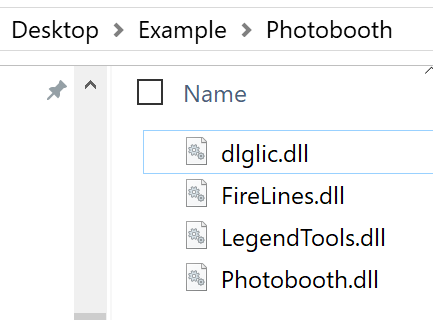
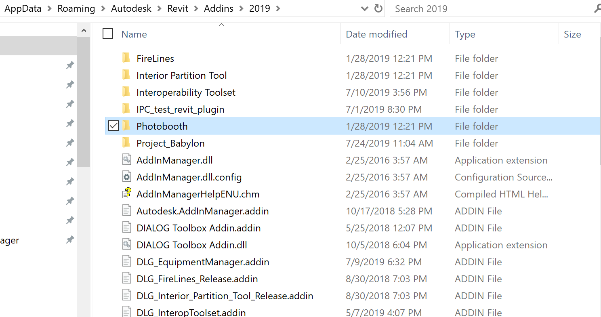

# Getting Started

If you want to create an msi installer that just copies files from your developer machine, into a specific destination on the user's machine, then Simple WiX is a simple to use, open source option, that is also designed to integrate cleanly into a continuous integration / continuous delivery workflow. 

Let's start with an example; personally I write a lot of plugins for Autodesk's Revit, a 3D modelling software. These plugins are written in C# and ultimately produce a bunch of mostly DLL files, something like this:

To install this on a user's machine, I just just need either the individual files or the whole Photobooth folder to be copied into the right Autodesk folder under a user's Roaming\AppData folder.

But how do I do that?

I can send someone a zip file or maybe a self extracting zip file, and ask them to get the files into there, but that's onerous, there's no simple update method, and there's a bunch of unhandled problems like 'what happens if it's interrupted', 'how does the user remove it easily', and 'what about settings files created during runtime'? Solving these problems in a reliable method is why the Windows Installer Framework was created and is ultimately what we want to use.

That being said, the Windows Installer Framework is quite low level, with a number of complicated steps and registries and tables to manage, so it typically is not used directly, but instead, intermediary frameworks exist. One of the most reliable and robust ones is the Microsoft published open source WiX framework. I learned it and began using it, however, I don't think I'm the first one to find that it's a little too low level for many development cases, so I wrote the Simple-Wix utility to create your WiX files for you. That way you get all the benefits of WiX, without the hastle of actually writing WiX. 

### Quick Start

So to package my files up for installation, I just need to follow these steps:

1. Download and install the [WiX Toolset](https://wixtoolset.org/releases/).

2. Download the SimpleWix.exe file somewhere on your computer, I'm going to put it right next to my installation folder to make writing relative paths a little easier:

3. Generate a manifest file for your project, I'm going to use the command line and call *simplewix.exe init* to walk me through this:

4. Now that you have a manifest, you can simply run simplewix.exe from the the command line with no arguments, or double click on it in file explorer and it will generate several intermediary files for debugging along with your completed .msi file!

5. And that's it, simply run your msi file, click "next, next, next" like always, and those files will be installed on your machine with proper registration for clean upgrades and uninstallations. 

If you'd like some more detail on this process and the various options available to customize your installation you can find it [here](moredetail.md).

<i> Final Note:</i> Hang onto your manifest file, and specifically the GUIDs created by both the UpgradeCode and the ProductCode. These two GUIDs are what uniquely identify your product to Windows so that it knows when to upgrade vs create a new installation. If these change Windows will see your two versions as completely unrelated applications. 

